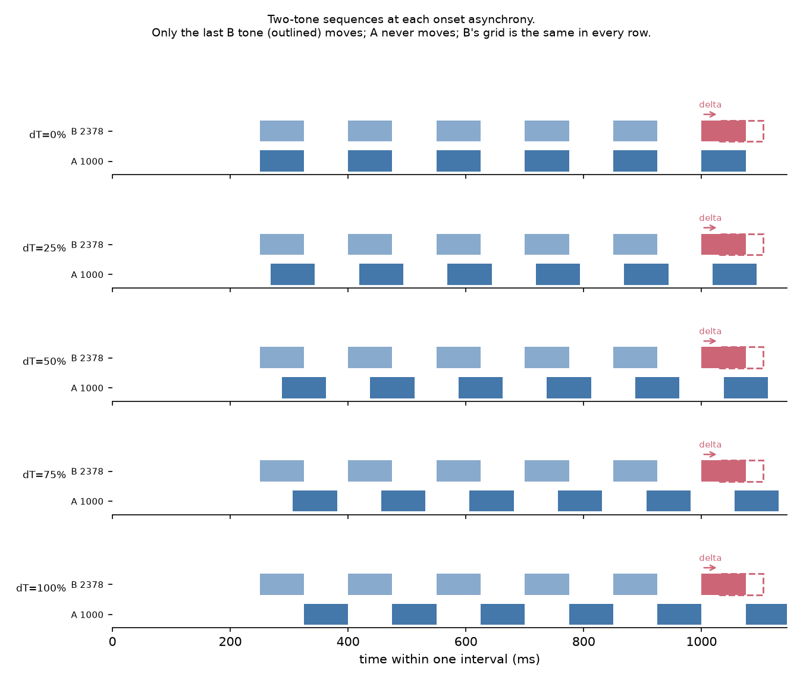
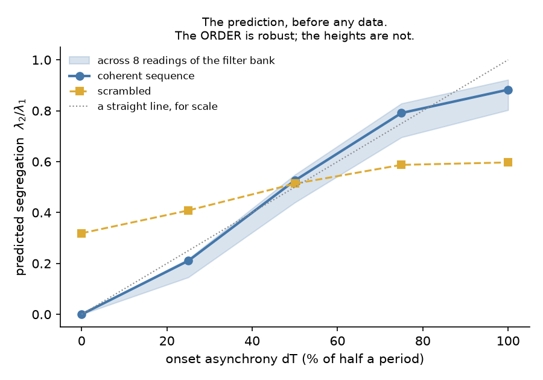
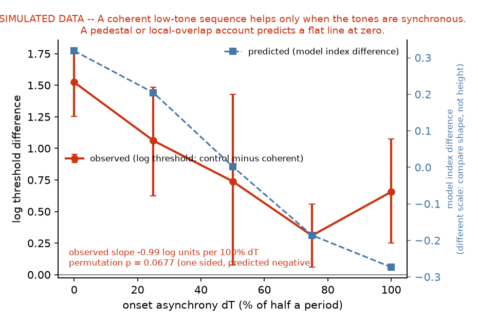

# tcoh — two-tone coherence

**Does onset asynchrony break the binding of two tones, and does it do so the way the temporal
coherence model says?**

A behavioural counterpart to Figure 8B of Elhilali, Ma, Micheyl, Oxenham & Shamma (2009,
*Neuron* 61:317–329), measured with the asynchrony-detection task of their Figure 2, generalised
so that onset asynchrony is a parametric variable rather than a two-level contrast.

This is an **independent task**. It shares no stimulus code, no trial schema and no analysis
with the stochastic figure-ground experiments in `seqsfg/`.

Read [PREREGISTRATION.md](PREREGISTRATION.md) first: it states the prediction, the hypotheses,
the decision rules and the measured power, and it is the document the rest of this package
exists to serve.

---

## The idea in one paragraph

Two isochronous pure tones, low (A) and high (B), six each, 150 ms apart. A lags B by **ΔT**,
expressed as a percentage of half the period: 0% is exact synchrony, 100% exact alternation.
Two such sequences per trial; in one of them the **last B tone is displaced by ±δ**; the
listener says which. If the tones are one object, a displacement changes that object and is
detectable at a few milliseconds. If they are two streams, the listener has only the B rhythm
and thresholds are an order of magnitude worse. Sweeping ΔT and normalising the threshold
between those two endpoints gives a behavioural quantity on the same 0-to-1 scale as the
model's λ₂/λ₁.



## Quick start

```bash
python -m tcoh design            # the conditions, the geometry, the duration
python -m tcoh model             # the prediction, checked against the published figure
python -m tcoh verify            # 22 checks that need no listener
python -m tcoh power             # what this design can and cannot detect
```

To hear it:

```bash
python -m tcoh demo --out demo --delta 25
```

To run a session:

```bash
python -m tcoh run --data data --code P01
```

and afterwards:

```bash
python -m tcoh analyze data/P01/tcoh_session_01
```

To exercise the whole pipeline with no listener at all — the report labels the output as
simulated on every page:

```bash
python -m tcoh simulate --mode coherence --data /tmp/tcohsim && python -m tcoh analyze /tmp/tcohsim/SIM01/tcoh_session_01
```

## The three invariants

Everything the design claims rests on these, and `python -m tcoh verify` checks each one
sample by sample rather than in prose:

1. **Within a trial the two intervals are bit-identical except for one tone's position.**
2. **A never moves**, so the low tone alone carries no information about which interval is
   which. An observer listening only to A is at chance by construction.
3. **B's grid is identical in every condition**, so whatever the high tone affords on its own
   is the same at every ΔT.

Together, the information in either channel *alone* is constant across conditions; only the
**relation** between them varies with ΔT. Any single-channel account of a ΔT effect is
excluded by construction, not by argument.

## What the model contributes, and one thing it decided

`tcoh/model.py` re-implements the paper's coherence analysis for two channels, because the
prediction that matters is the one for *our* stimulus, not the one drawn on their figure.

Taken as bare arithmetic the published equation does not reproduce the published numbers: two
perfectly alternating channels are *anti*-correlated rather than uncorrelated, giving
λ₂/λ₁ = 0.16 where the paper reports 0.93, and a non-monotone curve. Reading step 2 as the
**coincidence detection** the paper's own text describes — a rectified product — reproduces
both stated values and the stated monotonicity:

| reading | ΔT = 100% | ΔT = 0% | monotone |
|---|---|---|---|
| signed product (literal) | 0.156 | 0.000 | no |
| analytic magnitude | 0.041 | 0.000 | no |
| **half-wave rectified** | **0.893** | **0.000** | **yes** |
| published | 0.93 | 0.01 | yes |

This is an inference about an under-specified method, flagged as one everywhere it matters.

The model also settled a design question. **ΔT is only an ordered axis when the tone fills
exactly half the period.** At any other duty cycle the predicted index is *not monotone* in ΔT
— it peaks near 75% and falls again at full alternation — so a monotone behavioural result
would confirm nothing. The configuration validator refuses other duty cycles.



## The conditions

| condition | A sequence | for |
|---|---|---|
| `coh_0 … coh_100` | isochronous at lag ΔT | the sweep |
| `scr_0 … scr_100` | precursors at random times, final A tone unmoved | control 1 |
| `b_only` | absent | the ceiling |
| `par_*` | only the final A tone | control 2 (`tcoh_full`) |
| `bld_*` | 13 precursors instead of 5 | build-up (`tcoh_full`) |
| `b_only_long` | absent, 13 precursors | the ceiling the build-up comparison is scored against |

Both controls hold the **final A–B interval exactly** and remove only the A sequence. That is
what makes them decisive: an interval-discrimination (Weber) account and a local
acoustic-overlap account each depend only on the final pair, so both predict **no difference at
any ΔT**, while the coherence account predicts a large difference at synchrony that vanishes at
alternation. Different shapes, so the data can choose.

The controls fail in different directions and neither is decisive alone — the scrambled one
matches tone count and energy but its own coherence is not flat across ΔT; the pair-only one
has no A sequence by construction but holds five fewer tones. The argument rests on their
agreeing.

## The tests, and what each can settle

| | what it asks | what it separates |
|---|---|---|
| **H1** | does threshold rise with ΔT? | **nothing** — every account predicts a rise |
| **H2** | coherent vs control at matched ΔT | **the decisive one**: coherence vs interval discrimination vs local overlap |
| **H3** | 5 precursors vs 13 | coherence vs anything local to the final pair |
| **H4** | the shape against the model curve | reported, and explicitly not evidence (see below) |

**H3 is confounded unless it is scored as an interaction**, and it is. Lengthening the
precursor lengthens the *B* sequence too, and a longer rhythm is easier to judge whether or not
anything streams — an advantage pointing the same way as the prediction. So the design carries
a second ceiling, `b_only_long`, and H3 subtracts the gain that is merely about having more
rhythm to listen to. Without it, `analysis.buildup_test` says the comparison is confounded
rather than reporting a number.

**H4 is honest about being weak.** Over the ΔT levels used, the model's curve correlates with
a straight line at r = 0.988 and differs by at most 0.15 once both are rescaled. No realistic
amount of data separates them. The report prints the comparison with that caveat attached and
draws no conclusion from the winner.



## Power, measured rather than assumed

Running the whole pipeline against simulated listeners generated by the hypothesis and by each
rival (`python -m tcoh power`, 100 sessions per truth):

| generating truth | H1 fires | H2 fires |
|---|---|---|
| coherence (the hypothesis) | 100% | **87%** |
| pedestal (the Weber rival) | **100%** | 4% |
| null | 6% | 3% |

The middle row is the point: **the rival produces H1 on every single simulated session.**

A shortened design — control at three ΔT levels, two tracks per condition — keeps 99% power for
H1 and drops to **9%** for H2. It is a screen, not a test, and `validate` says so on every run.

## Configurations

| preset | conditions | trials | minutes | for |
|---|---|---|---|---|
| `tcoh_core` | 11 | 1382 | 121 | **the default.** 87% power on H2 |
| `tcoh_full` | 19 | 2387 | 209 | adds the pair-only control and build-up |
| `tcoh_screen` | 9 | 768 | 67 | a screen. 9% power on H2 — not a test |
| `tcoh_fine` | 13 | 1089 | 95 | nine ΔT levels, control at three |
| `tcoh_elhilali_replication` | 5 | 837 | 73 | her Figure 2 directly, tempo controls, monaural |

```bash
python -m tcoh run --config tcoh/configs/tcoh_full.json --data data
```

Sessions are long. They are meant to be split — the runner resumes, and every condition
contributes one track per round so a part-finished session is still balanced.

## The procedure

2I-2AFC, 3-down 1-up on a multiplicative step (×4 → ×2 → ×√2), threshold as the geometric mean
of the last six reversals at the final step size. This is Elhilali et al.'s rule, including the
one discrepancy in their Methods, which is [documented rather than silently
resolved](PREREGISTRATION.md#5-procedure).

Feedback is **on**, which is the opposite of the choice made for the yes/no tasks in this
repository. Those measure a criterion, which feedback distorts; 2AFC has none, the measure is a
threshold, and feedback keeps a listener calibrated through a long session. It is recorded per
trial regardless.

Catch trials at 6%, always supra-threshold, and they **never update the staircase** — a free
correct answer at 45 ms would drag the threshold down with it. A session missing more than 15%
of them is flagged and its thresholds are not reported as valid.

## Layout

```
tcoh/
  model.py         the coherence model, reduced to two channels: the prediction
  config.py        every parameter, and the validator that refuses impossible ones
  stimulus.py      building and rendering a trial, and the invariants
  track.py         the staircase, and the simulation that says what it measures
  psychometric.py  psychometric functions: the simulated listener and the fit
  design.py        the order of the session
  observer.py      simulated listeners: the hypothesis and its rivals
  runner.py        running a session with a person
  analysis.py      thresholds, the coherence index, the tests, the power
  verify.py        everything checkable without a listener
  plots.py         figures
  configs/         five presets
  verification/    battery output, the design, the model checks, figures
  PREREGISTRATION.md
```

Tests are in `tests/test_tcoh.py` and `tests/test_tcoh_model.py` (73 of them; `pytest` from the
repository root runs them alongside everything else).

## Known limits

- Onset lag and acoustic overlap are perfectly confounded at a 50% duty cycle: ΔT% is exactly
  100 × (1 − overlap fraction). Breaking that needs a duty-cycle manipulation, which is a
  separate experiment; `allow_nonmonotone_duty` exists to build it.
- κ is normalised by two conditions measured in the same session, so a bad floor or ceiling
  moves the whole curve. Both are reported in milliseconds beside it.
- One listener generalises to one listener, and the report says so.
